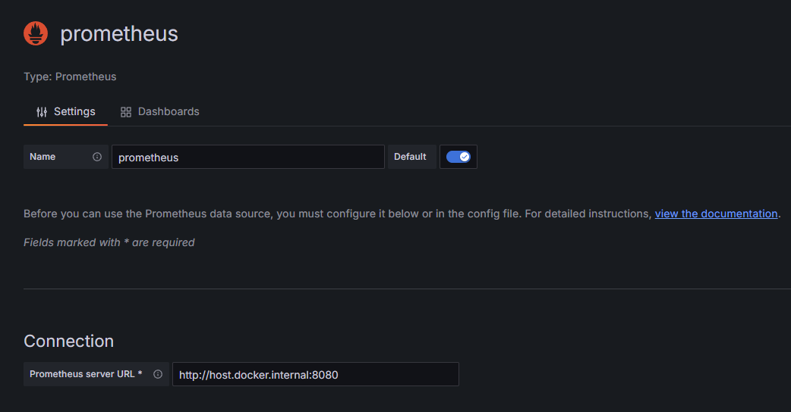
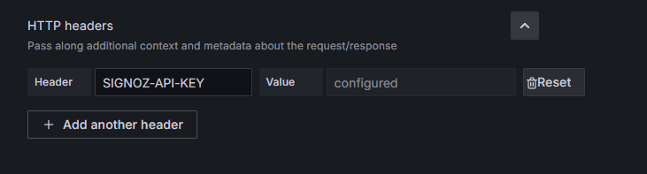
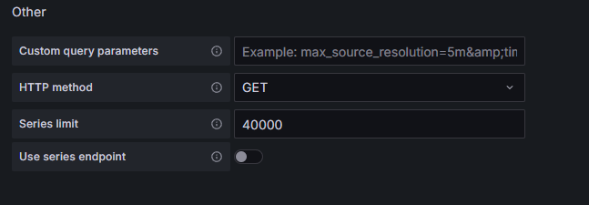

Note that all of this was tested with a self-hosted community edition of SigNoz and Grafana 12.3.

As of version 0.103.0, SigNoz can be used as a Prometheus data source in Grafana. The way to do it is this:

1. Create a new Prometheus data source and add the address of your instance of SigNoz



2. In SigNoz UI, generate an API key with the viewer role and in the Grafana's setup for the Prometheus data source add this header 



3. In the Other section change HTTP method to GET



Then if you press Save & test, the data source should work.

Now you should be able to create a new visualization with this data source and query SigNoz. Unfortunately SigNoz doesn't implement the APIs which Grafana uses for suggesting existing time series and labels, so you can't use those features out of the box.

This app implements those missing APIs and acts as a proxy between Grafana and SigNoz. If you deploy it and point the Prometheus data source to the Docker container with other settings set according to the instructions above, the proxy will call the existing SigNoz API and return data in the Prometheus-compatible format. Then you should be able to see suggestions for existing metrics and labels in Grafana when creating a visualization. I haven't tested the proxy thoroughly with Drilldown.

The address of your SigNoz instance can be set using the `SIGNOZ_URL` environment variable. If you use the `docker-compose.yaml` file from this repository on the same machine where SigNoz is running, it should work out of the box.

## Environment variables

| Variable | Default | Description |
| --- | --- | --- |
| `SIGNOZ_URL` | `http://signoz:8080` | Base URL of the SigNoz instance the proxy forwards requests to. Must be a valid URL; the process exits on startup if it isn't. |
| `SIGNOZ_TLS_SKIP_VERIFY` | `false` | When set to `true`, disables TLS certificate verification on outbound calls to SigNoz. Intended for self-signed certificates in trusted environments — do not enable in production. |
| `SIGNOZ_TLS_CA_CERT` | — | Path to a PEM CA bundle used to verify the SigNoz server certificate, in addition to the system roots. Use this instead of `SIGNOZ_TLS_SKIP_VERIFY` for private or self-signed CAs. The process exits on startup if the file is missing or contains no valid certificates. |
| `PORT` | `8081` | TCP port the proxy listens on. |
| `LOG_LEVEL` | `info` | Zap log level. Accepts `debug`, `info`, `warn`, `error`, `dpanic`, `panic`, `fatal`. Invalid values fall back to `info` and a warning is written to stderr. |

## Tracing

The proxy is instrumented with OpenTelemetry. Each incoming request becomes a server span (named by route template, e.g. `/api/v1/label/{label}/values`), and each outbound call to SigNoz becomes a nested client span with W3C `traceparent` propagation.

Tracing is configured entirely through the standard OpenTelemetry environment variables. The most relevant ones:

| Variable | Default | Description |
| --- | --- | --- |
| `OTEL_TRACES_EXPORTER` | `otlp` | Exporter to use: `otlp` (export over OTLP), `console` (print spans to stdout for debugging), or `none` (disable tracing). |
| `OTEL_EXPORTER_OTLP_PROTOCOL` | `http/protobuf` | OTLP wire protocol: `http/protobuf` or `grpc`. `OTEL_EXPORTER_OTLP_TRACES_PROTOCOL` overrides it for traces only. |
| `OTEL_EXPORTER_OTLP_ENDPOINT` | `http://localhost:4318` (HTTP) / `http://localhost:4317` (gRPC) | Collector address. `OTEL_EXPORTER_OTLP_TRACES_ENDPOINT` overrides it for traces only. |
| `OTEL_SERVICE_NAME` | `signoz-prometheus` | Service name attached to all spans and log records. |
| `OTEL_RESOURCE_ATTRIBUTES` | — | Extra resource attributes, e.g. `deployment.environment=prod,service.version=1.0.0`. |

When `OTEL_TRACES_EXPORTER=otlp`, every OTLP exporter setting from the [OTLP exporter spec](https://opentelemetry.io/docs/specs/otel/protocol/exporter/) is honored automatically, in both the generic `OTEL_EXPORTER_OTLP_*` and signal-specific `OTEL_EXPORTER_OTLP_TRACES_*` form: `ENDPOINT`, `INSECURE`, `HEADERS`, `TIMEOUT`, `COMPRESSION`, `CERTIFICATE`, `CLIENT_CERTIFICATE`, and `CLIENT_KEY`.

Example — export over gRPC to a collector that requires an auth header:

```
OTEL_TRACES_EXPORTER=otlp
OTEL_EXPORTER_OTLP_PROTOCOL=grpc
OTEL_EXPORTER_OTLP_ENDPOINT=https://collector:4317
OTEL_EXPORTER_OTLP_HEADERS=signoz-access-token=<token>
OTEL_EXPORTER_OTLP_COMPRESSION=gzip
```

## Logging

Application logs (zap) are written to stdout as before, and are additionally bridged to OpenTelemetry and exported over OTLP, sharing the same resource (`service.name`, etc.) and OTLP connection settings as traces. Log export is configured with its own exporter selector, mirroring the tracing one:

| Variable | Default | Description |
| --- | --- | --- |
| `OTEL_LOGS_EXPORTER` | `otlp` | Exporter to use: `otlp` (export over OTLP), `console` (print records to stdout for debugging), or `none` (stdout logging only; no OTLP export). |
| `OTEL_EXPORTER_OTLP_LOGS_PROTOCOL` | inherits `OTEL_EXPORTER_OTLP_PROTOCOL` | OTLP wire protocol for logs only: `http/protobuf` or `grpc`. |
| `OTEL_EXPORTER_OTLP_LOGS_*` | inherits `OTEL_EXPORTER_OTLP_*` | Per-signal overrides for `ENDPOINT`, `HEADERS`, `TIMEOUT`, `COMPRESSION`, TLS, etc., honored automatically as for traces. |

`LOG_LEVEL` gates both sinks, so the OTLP log stream matches what is written to stdout.
